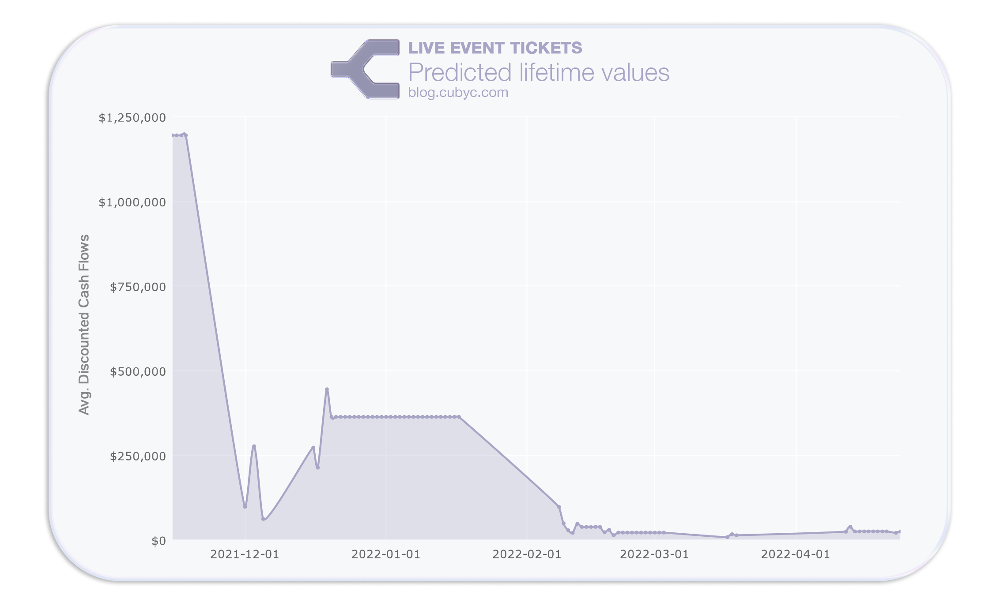

## Predicting Customer Lifetime Value with Cubyc Anterior.
Using Cubyc's Anterior engine to build a discounted cash flow model and derive a liftime value per customer.

---

#### What's a Customer Lifetime Value (CLV) model? 
CLV models are mainly used by marketers to assign value to users in their database using two main metrics:
- **Frequency of future purchases** - how many times will a user convert again? 
- **Monetary Value** - how much will a user continue to spend?

This allows marketing scientists to target users who are either increasingly converting, but also increasingly churning with the correct content; the right message with the right audience.

Further, we will look at these metrics from a **discounted cash flow** perspective taking it a step further and asking: "Is a user worth the present or the future cash flows they are bringin to our business?"

Here's how we did it:
#### Overview
1. Gathering the data
2. Setting up Anterior
3. v0 model
4. Backtesting
5. Model Improvements

> If you've seen Cubyc articles before, this schema might be familiar. Skip to the modeling process jump to **3. v0 model** .

---
### (1/5) Gathering the data
For this project, we're using Cubyc's ticketing dataset.


```python
from anterior import BackTester, OracleDataFrame
import pandas as pd
df = pd.read_csv("github.com/cubyc-team/articles/data/ticketing.csv")
# we need to make sure our date column is encoded to datetime
```

To replace this dataset with your own, make sure your data has the following columns: 
- **Sale date** date (time optional) when the ticket was sold
- **Unique User ID** any sort of customer ID, such as email, name-lastname, phone number, or just a random unique string like we used.
- **Sale price** the ($) amount the client spend for that transaction. 

You want an entry (row) per transaction per user. That means that if user "Travis Scott" bought four tickets across two days and for different sections, there will be four different entries, each with the same `unique ID`, but different `sale date` and `sale price`.

The last step is creating `frequency`, `recency`, `T`, and `monetary_value` columns. Thankfully, the Lifetimes library handles all of this for us:
```python
# I'll create a function to handle this programatically, 
# this is important for backtesting.
def encode(data):
    data['saleDate'] = pd.to_datetime(data['saleDate'])
    data = data.sort_values('saleDate')
        
    summary = sdtf(data, 
        customer_id_col="client_id",
        datetime_col="saleDate",
        monetary_value_col="priceAmount")

    summary = summary[summary.monetary_value > 0]
    return summary
```
---
### (2/5) Setting up Anterior
We're using Cubyc Anterior to backtest and evaluate our model performances. This allows us to build not one, but many model iterations and choose the combination of factors that best explain our data.


```python
df.saleDate = pd.to_datetime(df.saleDate)
df = df.set_index("saleDate")
odf = OracleDataFrame(df)
```
---

### (3/5) v0 Model

The [Lifetimes](https://lifetimes.readthedocs.io/en/latest/Quickstart.html#basic-frequency-recency-analysis-using-the-bg-nbd-model) library includes several models. 

- **BetaGeoFitter (BG/NBD model)** to predict pruchases.
- **GammaGammaFitter** to predict future cashflows.

We'll start by predicting future purchases per user using the `BetaGeoFitter` model:

```python
def purhcases_pred(penalizer=0.4):
    # BG/NBD model :: predicted purchases        
    data = odf[odf.index > max(odf.index) - pd.Timedelta(days=14)]
    data = data.reset_index()
    data = encode(data)

    # fit the BG/NBD model
    bgf = BetaGeoFitter(penalizer_coef=penalizer)
    bgf.fit(data['frequency'], data['recency'], data['T'])

    # bgf.predict(data)
    return bgf, data
```
The output for this model looks like this:


> For userId "asdasdsa" the expected number of purchases in the next 14 days is X.

Now, we'll use the `GammaGammaFitter` model to calculate the discounted cash flows (DCF) for each user. 
> **[Investopedia](https://www.investopedia.com/terms/d/dcf.asp)** DCF analysis attempts to determine the value of an investment today, based on projections of how much money that investment will generate in the future.

DCF Model boilerplate:
```python
def dcf(penalizer=0.4):
    # fit the Gamma-Gamma submodel
    data = odf[odf.index > max(odf.index) - pd.Timedelta(days=14)]
    data = data.reset_index()
    data = encode(data)
    
    # fit Gamma Gamma Fitter model
    ggf = GammaGammaFitter(penalizer_coef=penalizer)
    ggf.fit(data['frequency'], data['monetary_value'])
    
    # ggf.predict(data)
    return ggf, data
```
---
### (4/5) Backtesting
For this backtest, we're going to wrap our Anterior logic in a function named `process`.

```python
vals = []
def process():
    try:
        purch_model, data = purhcases_pred()
        purch_model.predict(90, data.frequency, data.recency, data["T"])
        lifetimes_model, data_dcf = dcf()
        vals.append((datetime.datetime.now(), lifetimes_model.customer_lifetime_value(purch_model, data_dcf['frequency'],
                                                data_dcf['recency'],
                                                data_dcf['T'],
                                                data_dcf['monetary_value'],
                                                time=1,
                                                freq='H',
                                                discount_rate=0.01)))
    except:
        return
```

Now:
```python
bt = BackTester()
bt.every(days=1).do(main)
bt.run('2021-11-15', '2022-05-15')
avgs = [(date, val.mean()) for date, val in vals if val.mean() > 0]
```



---
### (5/5) Model Improvements
There's a few ways we can improve our model.
We propose the following:
- Subset the data by ticket type.
- Prune outlier dates.
- Play with model parameters

For example, by subsetting by ticket types, we can a closer peek at lifetime values at each arena point.

Subsequently, we can remove some of the outlier dates such acs the event in December, which was a massive outlier for our dataset.

Lastly, by changing parameter `param_a penalizer` to 
0.35, we get the following chart.


